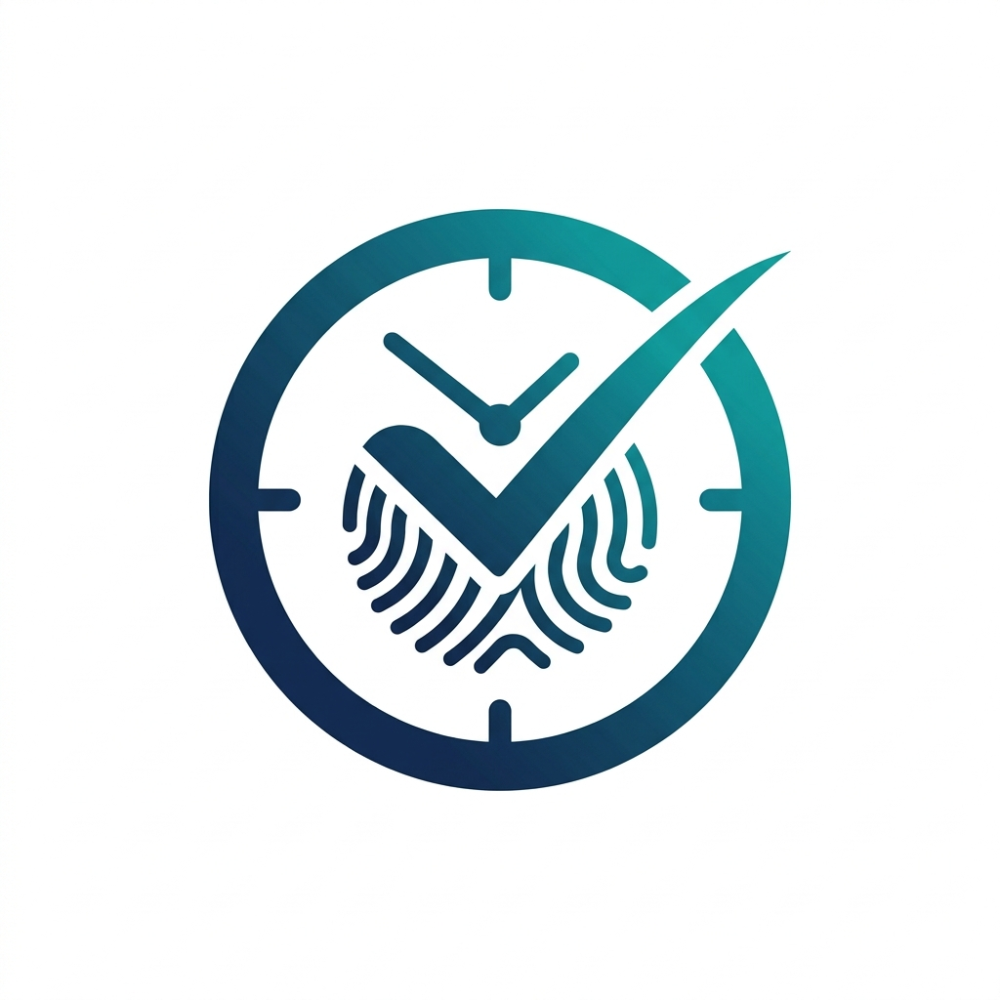
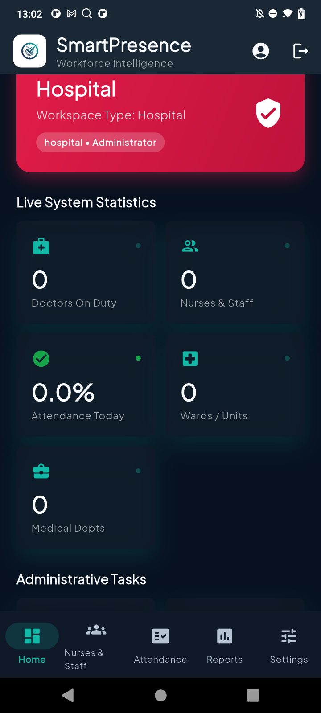
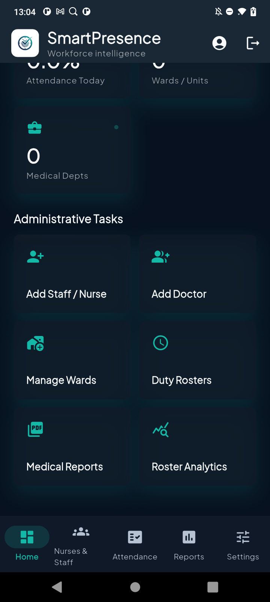
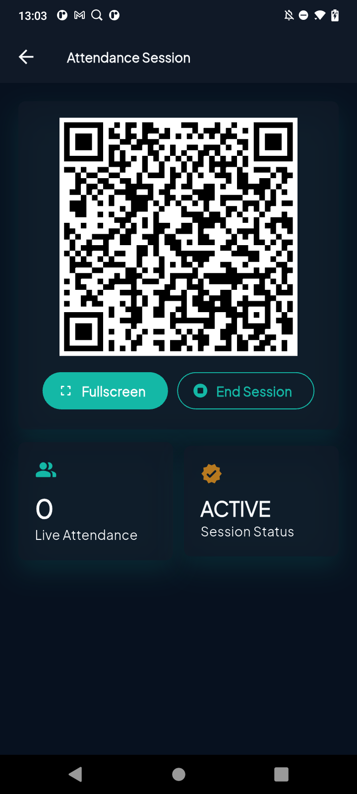
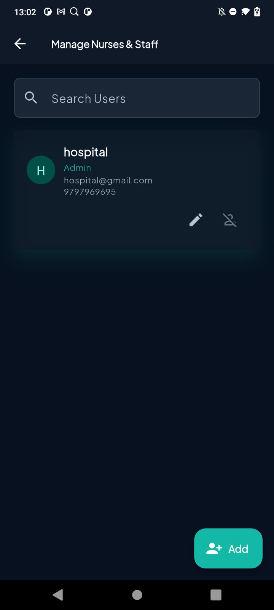
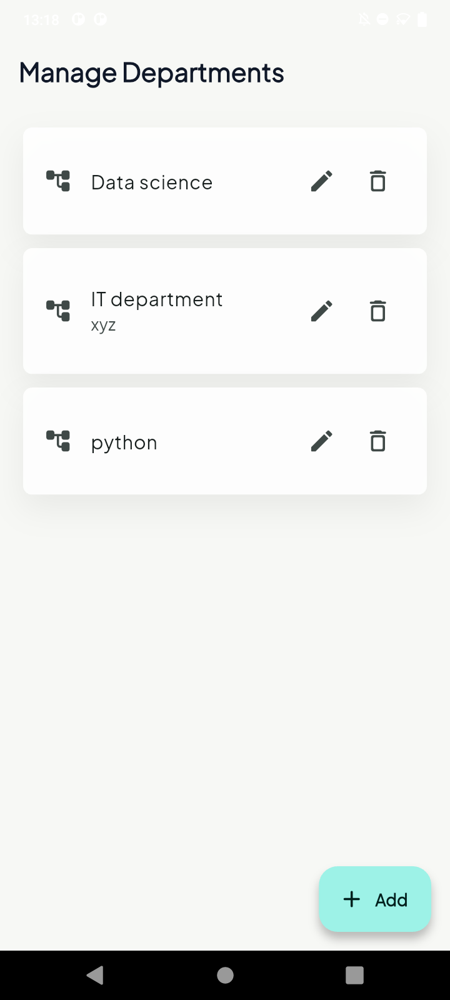
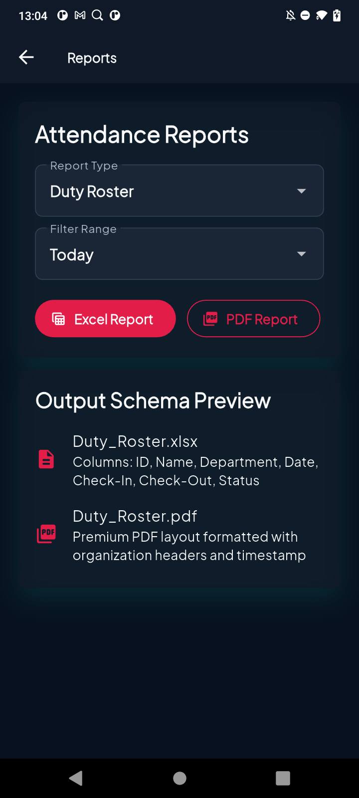
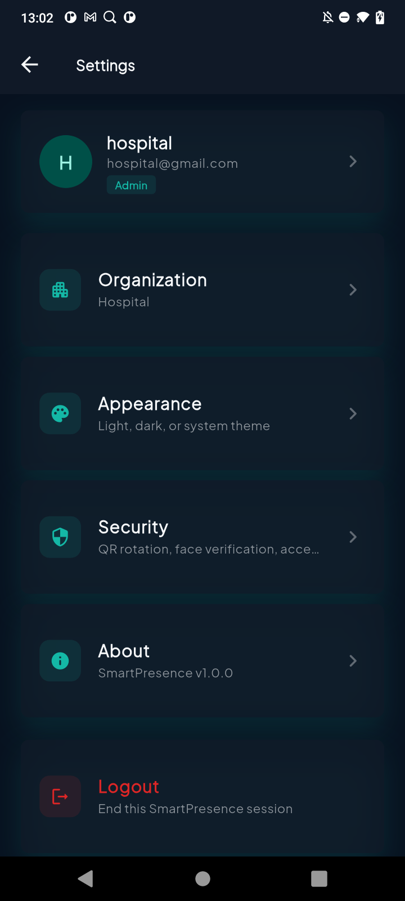
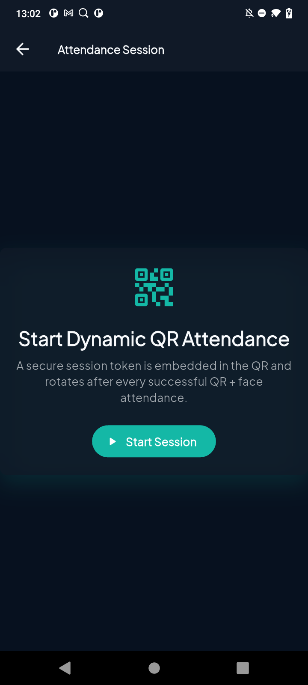
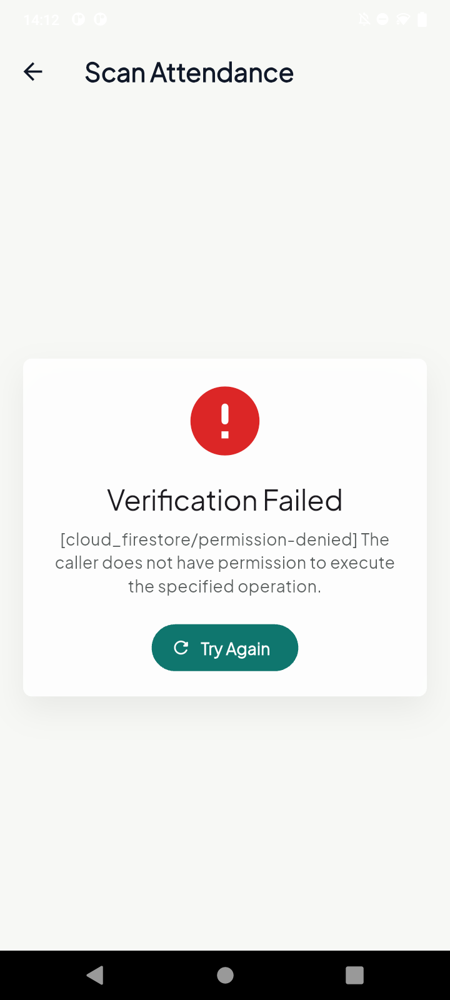

<p align="center">
  
</p>

# 📱 SmartPresence — Smart Attendance & Workforce Management Platform

[](https://flutter.dev)
[](https://firebase.google.com)
[](https://bloclibrary.dev)
[](https://pub.dev)

SmartPresence is an enterprise-grade, multi-tenant workforce intelligence and attendance management platform. Built using **Flutter** and **Firebase**, it is designed to cater to various organizational verticals (Hospitals, Corporate Offices, Factories, Schools, Retail, and Warehouses) through a highly adaptive dynamic configuration system. 

The platform features an advanced **AI-powered anti-proxy verification mechanism** (combining dynamic rotating QR codes and device-side ML Kit face landmark ratio verification) to ensure high-fidelity presence auditing.

---

## 🚀 Core Capabilities

1. **Anti-Proxy Attendance Engine**:
   - **Dynamic Rotating QR Codes**: Generates time-sensitive QR codes embedded with secure cryptographic session tokens that rotate automatically after each scan.
   - **AI Face Verification**: Runs local real-time face detection on mobile devices using **Google ML Kit** to measure face positioning and key landmark ratios to prevent photo/video spoofing.
   - **Manual Fallback**: Automated photo-proof capturing for web and desktop environments where ML Kit is not natively available.
2. **Dynamic Tenant Adaptation (Multi-Tenant System)**:
   - Adapts terminology, styling, branding colors, navigation routes, and dashboard widgets on-the-fly based on the workspace type.
3. **Advanced Reporting**:
   - One-click export of data to formatted Excel files and premium PDF documents.
4. **State-of-the-Art Architecture**:
   - Built with BLoC/Cubit for predictable state cycles, GoRouter for declarative routing, and Firestore for real-time synchronization.

---

## 🎨 Dynamic Multi-Tenant UI Configurations

SmartPresence dynamically alters its interface parameters, branding colors, and terminology based on the organization's vertical configuration:

| Workspace Type | Member Label | Manager Label | Primary/Secondary Theme Colors | Enabled Modules |
| :--- | :--- | :--- | :--- | :--- |
| **Hospital** | Nurse / Staff | Doctor | `0xFFE11D48` / `0xFFBE123C` (Rose Red) | Attendance, Staff, Roster, Shifts |
| **Corporate** | Employee | Manager | `0xFF2563EB` / `0xFF0D9488` (Blue & Teal) | Attendance, Employees, Leave |
| **Factory** | Worker | Supervisor | `0xFFEA580C` / `0xFFD97706` (Orange & Amber) | Attendance, Workers, Shifts, Leave |
| **School** | Student | Teacher | `0xFF10B981` / `0xFF3B82F6` (Green & Blue) | Attendance, Students, Timetable |
| **Retail** | Associate / Cashier | Store Manager | `0xFF7C3AED` / `0xFFC026D3` (Violet & Fuchsia) | Attendance, Staff, Branch, Shifts |
| **Warehouse** | Loader / Operator | Floor Supervisor | `0xFF4F46E5` / `0xFF06B6D4` (Indigo & Cyan) | Attendance, Workers, Warehouse, Shifts |

---

## 📸 Application Screenshot Showcase

Here is a visual walk-through of the SmartPresence app interface, styled in its premium dark and light modes.

### 1. Dashboard & Administrative Tasks
The main dashboard dynamically updates its terminology, metrics, and quick actions based on the organization's configuration. In hospital mode, it shows duty statistics and staff modules.

#### Live Statistics Dashboard


#### Administrative Modules


---

### 2. Smart Attendance & Rotating QR
Proctors can launch a dynamic QR session. The QR token refreshes constantly. It can be projected in fullscreen mode in physical settings.

#### Attendance Session Controller


#### Fullscreen Presenter Mode


---

### 3. Workforce Management & Directory
Managers can search, edit, register, or delete personnel records. The department structures adapt to school classes, warehouse zones, or hospital wards.

#### Manage Personnel Registry


#### Manage Departments (Light Mode)


---

### 4. Advanced Reporting & Settings
Export custom duty rosters, shifts, or timesheets to XLSX and PDF formats. Settings include themes, biometric settings, and system information.

#### PDF / Excel Report Exporters


#### Settings Panel


---

### 5. Attendance Verification & Security Checks
Attendance verification triggers real-time face metrics analysis. Detailed validation states ensure high transparency if permission or connection issues arise.

#### Dynamic QR Scanner Setup


#### Verification Exception Handling


---

## ⚙️ Face Verification Mechanism (AI Guard)

Rather than checking absolute pixel distances (which skew with distance from camera or resolution changes), SmartPresence calculates normalized relative landmark ratios:

1. **Face Pose Angle Check**: Runs real-time orientation checking using Google ML Kit. Face must be front-facing:
   $$\text{Head Yaw} \le 25^\circ, \quad \text{Head Pitch} \le 15^\circ$$
2. **Relative Landmark Ratios**: Calculates distances normalized by the inter-pupillary distance ($D_{eyes}$):
   - **Eye-to-Nose Ratio**: Distance from eye midpoint to nose base / $D_{eyes}$
   - **Mouth Width Ratio**: Distance between mouth corners / $D_{eyes}$
   - **Nose-to-Mouth Ratio**: Distance from nose base to mouth bottom / $D_{eyes}$
   - **Eye-to-Mouth Ratio**: Distance from eye midpoint to mouth bottom / $D_{eyes}$
3. **Verification Match**: Compares verification ratios to registration templates. If deviation is $\le 25\%$, verification is marked successful.

---

## 🛠️ Project Architecture

```
lib/
├── app/                  # Application initialization & routing (GoRouter)
├── core/                 # Shared resources, themes, widgets, and base models
│   ├── config/           # Multi-tenant workspace layouts & dashboard systems
│   ├── enums/            # Directory types, roles, organization types
│   └── theme/            # Light/Dark HSL-tailored premium theme systems
└── features/             # Feature-first modules
    ├── analytics/        # Roster coverage & attendance trend charts
    ├── attendance/       # QR session generation, QR scanning, ML Kit logic
    ├── auth/             # Multi-role authentication & session state
    ├── dashboard/        # Adaptive statistics & task grids
    ├── directory/        # Department, section, ward master data
    ├── profile/          # User profile view and update
    ├── reports/          # Excel & PDF generation streams
    ├── settings/         # Organization settings, security, appearance
    ├── shifts/           # Shifts and Duty roster management
    └── users/            # Dynamic User Creation wizard & verification checks
```

---

## 📥 Setup & Installation

### Prerequisites
- [Flutter SDK](https://docs.flutter.dev/get-started/install) (`^3.10.7`)
- [Dart SDK](https://dart.dev/get-started)
- CocoaPods (for iOS builds)
- Android SDK (for Android builds)
- Active [Firebase Project](https://console.firebase.google.com/) configured for authentication, storage, and firestore.

### Getting Started

1. **Clone the Repository**:
   ```bash
   git clone https://github.com/your-org/smartpresence.git
   cd smartpresence
   ```

2. **Install Dependencies**:
   ```bash
   flutter pub get
   ```

3. **Configure Firebase**:
   - Place your `google-services.json` in `android/app/`
   - Place your `GoogleService-Info.plist` in `ios/Runner/`
   - Run `flutterfire configure` to generate web and desktop keys.

4. **Run the Application**:
   ```bash
   flutter run
   ```

---

## 📦 Core Dependencies

- `flutter_bloc` & `shared_preferences`: Robust caching and predictable state cycles.
- `google_mlkit_face_detection`: Fast device-side landmark extraction.
- `camera` & `mobile_scanner`: High-performance camera framing and fast QR decoding.
- `excel` & `pdf` & `printing`: Native report output rendering.
- `syncfusion_flutter_charts`: Premium data visualization widgets.
- `flutter_animate`: Fluid micro-animations and slide-in transitions.
